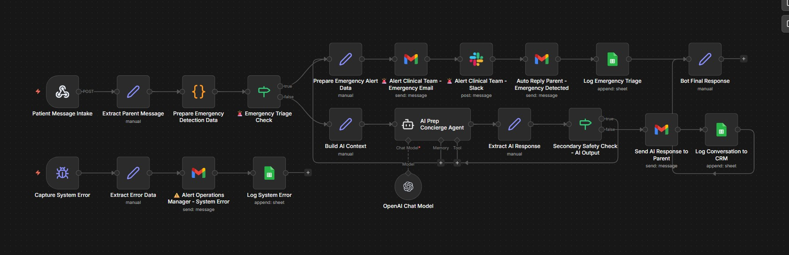

# 🌙 Pediatric Sleep Study Prep Concierge AI Assistant



## Overview

This n8n automation system delivers an AI-powered concierge experience for parents preparing their child for a pediatric sleep study. When a parent sends a message, the system first performs an **emergency triage check** — urgent clinical messages are immediately escalated to the clinical team via Gmail and Slack, while non-emergency messages are routed to an **OpenAI-powered Prep Concierge Agent** that delivers intelligent, context-aware responses. A secondary safety check validates all AI output before it reaches the parent, and a global error handler monitors the entire pipeline.

***

## 🗂️ Workflow Architecture

| Sub-Workflow | Trigger | Primary Function |
|---|---|---|
| Patient Message Intake → Emergency Triage → AI Concierge | Webhook (POST) | Triage incoming parent messages and respond via AI or escalate |
| Capture and Log Global System Errors | Error Trigger | Catch, log, and alert on system-wide failures |

***

## ⚙️ Sub-Workflow Breakdown

### 1. 🏥 Patient Message Intake → Emergency Triage → AI Concierge

**Flow:**
1. **Patient Message Intake** — Receives POST webhook from the parent messaging interface
2. **Extract Parent Message** — Parses message content and metadata
3. **Prepare Emergency Detection Data** — Structures payload for emergency analysis
4. **Emergency Triage Check** — Evaluates message for emergency signals and branches accordingly

**On Emergency Detected:**
- Alerts Clinical Team via Gmail + Slack
- Auto-replies to Parent confirming detection via Gmail
- Logs the emergency triage event to Google Sheets

**On Non-Emergency:**
- Builds AI context → Routes to **AI Prep Concierge Agent** (OpenAI + Memory + Tools)
- Extracts AI response → **Secondary Safety Check**
  - ✅ Safe → Sends response to Parent via Gmail + Logs to CRM
  - ⚠️ Flagged → Withholds response entirely

***

### 2. 🚨 Capture and Log Global System Errors

Intercepts unhandled failures across all stages, logs them to Google Sheets, and immediately alerts the Operations Manager via Gmail.

***

## 🛠️ Tech Stack & Integrations

| Tool / Service | Usage |
|---|---|
| **n8n** | Core workflow automation platform |
| **OpenAI (GPT)** | AI Prep Concierge Agent powering parent responses |
| **Google Sheets** | CRM conversation logging, emergency triage log, and error log |
| **Gmail** | Emergency alerts, parent auto-replies, AI responses, and system error alerts |
| **Slack** | Real-time emergency escalation alerts to Clinical Team |
| **Webhooks** | Parent message intake trigger |

***

## 👥 Stakeholder Notification Map

| Event | Notified Party | Channel |
|---|---|---|
| Emergency message detected | Clinical Team | Gmail + Slack |
| Emergency message detected | Parent (auto-reply) | Gmail |
| AI response ready (safe) | Parent | Gmail |
| AI response flagged (unsafe) | Response withheld | — |
| System error detected | Operations Manager | Gmail |

***

## 🔄 End-to-End Process Flow

```
Parent Sends Message
        │
        ▼
[Patient Message Intake]
   Extract → Prepare Emergency Detection Data
        │
        ▼
   Emergency Triage Check
        ├── 🚨 Emergency → Alert Clinical Team (Gmail + Slack) → Auto-Reply Parent ✅
        ▼ 💬 Non-Emergency
   Build AI Context → AI Concierge Agent (OpenAI + Memory)
        │
        ▼
   Secondary Safety Check
        ├── ⚠️ Flagged → Withhold Response
        ▼ ✅ Safe
   Send AI Response to Parent → Log to CRM ✅

[Global Error Handler] ← monitors all stages → Alert Operations Manager
```
